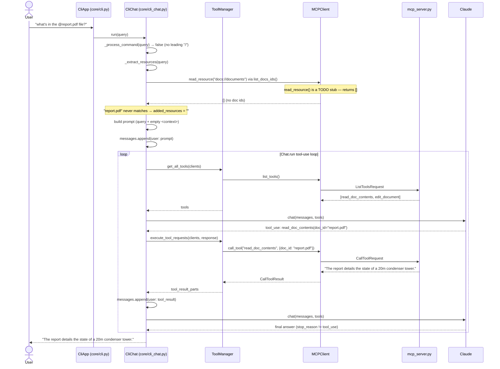

# `@doc` mention flow — BEFORE `read_resource` is implemented

This captures what actually happens **today** when a user types a query that
mentions a document, e.g.:

```
what's in the @report.pdf file?
```

At this point `MCPClient.read_resource()` (`mcp_client.py`) is still a
`# TODO` stub that always returns `[]`, and `mcp_server.py` defines **no**
`@mcp.resource(...)` at all. So the "resource" shortcut is a no-op, and the
query silently falls through to the normal tool-call loop instead.



## Why this happens

`@report.pdf` is *meant* to be resolved by
[`_extract_resources`](../cli_project/core/cli_chat.py) reading it directly
as an MCP **resource** and inlining its content into the prompt — skipping a
tool call entirely. That path is currently broken because:

- `MCPClient.read_resource()` in `mcp_client.py` is a `# TODO` stub that
  always returns `[]`.
- `mcp_server.py` has no `@mcp.resource(...)` defined (only TODO comments
  at the bottom of the file).

So `list_docs_ids()` always returns `[]`, `"report.pdf"` never matches, and
`added_resources` is always empty. The `@` mention currently does nothing
functionally — the correct answer still comes back, but only via the slower
tool-call round trip (`read_doc_contents`) instead of the intended
direct-resource-injection shortcut.

## What "after" should look like

Once `read_resource` (client) and a matching `@mcp.resource(...)` (server)
are implemented:

- `list_docs_ids()` will return real doc ids (e.g. `report.pdf`).
- `_extract_resources` will find `"report.pdf"` in `mentions`, fetch its
  content via `get_doc_content`, and inline it into the `<context>` block
  of the prompt.
- Claude will answer directly from the injected context — **no**
  `read_doc_contents` tool call needed for `@`-mentioned docs.

This file is the "before" baseline for that comparison.
