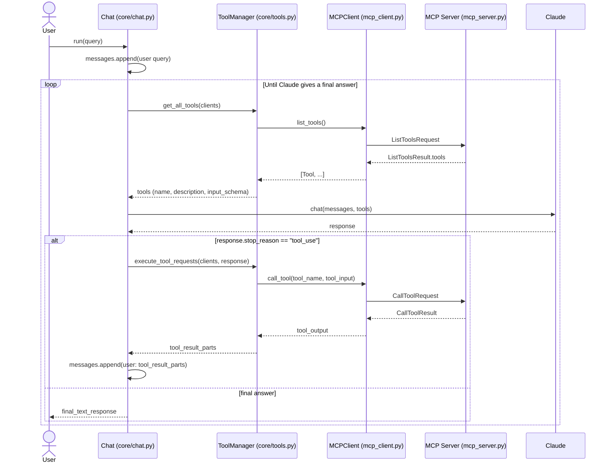

# Our actual code flow (cli_project)

This diagram maps the generic MCP client/server flow onto the real classes and
function calls in `mcp-intro/cli_project`, based on `core/chat.py`,
`core/tools.py`, and `mcp_client.py`.

## Step-by-step (matches the code, not just the concept)

1. **`Chat.run(query)`** appends the user's query to `self.messages`.
2. Every loop iteration, `ToolManager.get_all_tools(clients)` asks each
   connected `MCPClient` for its tools via `MCPClient.list_tools()`, which
   calls `session().list_tools()` and returns `result.tools`.
3. `Chat` sends `messages` + the tool list to `Claude` via
   `claude_service.chat(...)`.
4. If `response.stop_reason == "tool_use"`, `ToolManager.execute_tool_requests`
   finds the right client for the requested tool
   (`_find_client_with_tool`) and calls `MCPClient.call_tool(tool_name, tool_input)`,
   which sends a `CallToolRequest` to the MCP server and gets back a
   `CallToolResult`.
5. The tool result is packaged into a `tool_result` content block and
   appended to `messages` as a user message, then the loop repeats —
   Claude sees the tool output and decides whether it needs another tool
   call or can answer directly.
6. Once `stop_reason` is anything other than `"tool_use"`, the loop breaks
   and the final text response is returned up to the CLI / user.

## Difference from the generic "Github" example diagram

In this project, `mcp_server.py` is a `DocumentMCP` server backed by an
in-memory `docs` dict (`deposition.md`, `report.pdf`, etc.), exposing
`read_doc_contents` and `edit_document` as tools — not a GitHub repo API.
The wiring (client/server/Claude round-trips) is identical; only the
concrete tools and backing data differ.
