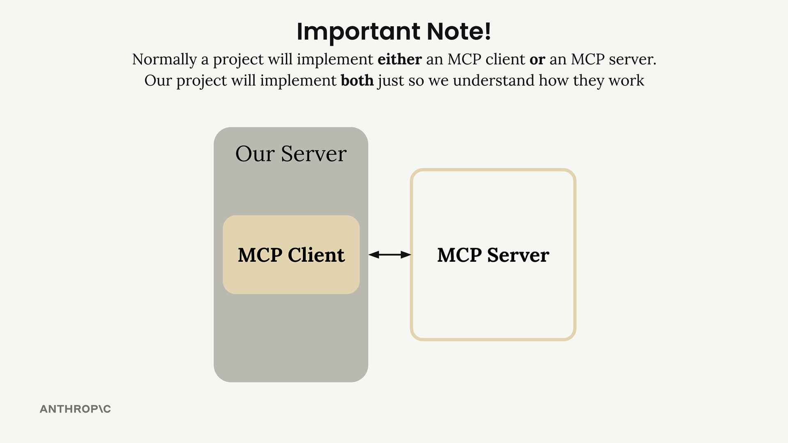
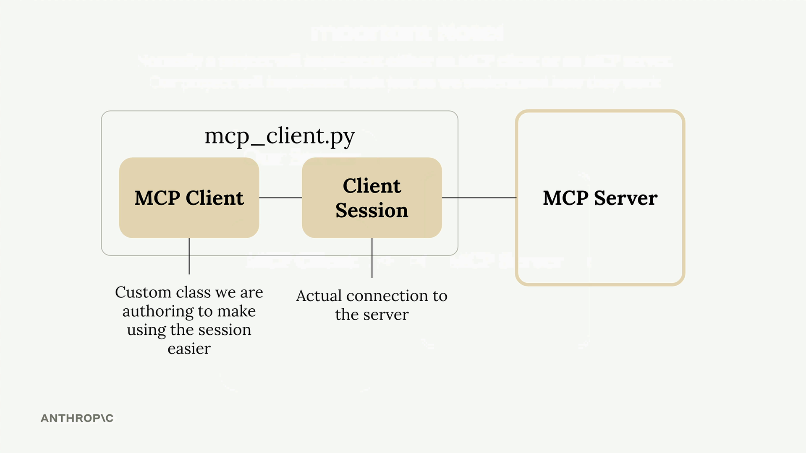
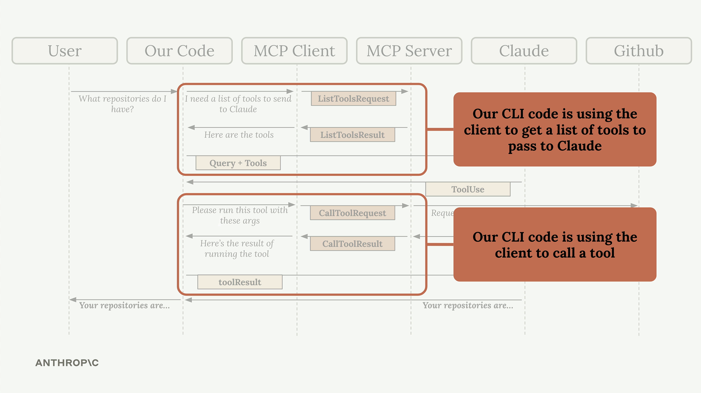

# Defining tools with MCP

Building an MCP server becomes much simpler when you use the official Python SDK. Instead of writing complex JSON schemas by hand, you can define tools with decorators and let the SDK handle the heavy lifting.

In this example, we're creating a document management server with two core tools: one to read documents and another to update them. All documents exist in memory as a simple dictionary where keys are document IDs and values are the content.

Tool Definition with Decorators
The SDK uses decorators to define tools. Instead of writing JSON schemas manually, you can use Python type hints and field descriptions. The SDK automatically generates the proper schema that Claude can understand.

The decorator specifies the tool name and description, while the function parameters define the required arguments. The Field class from Pydantic provides argument descriptions that help Claude understand what each parameter expects.


Key Benefits of the SDK Approach
No manual JSON schema writing required
Type hints provide automatic validation
Clear parameter descriptions help Claude understand tool usage
Error handling integrates naturally with Python exceptions
Tool registration happens automatically through decorators
The MCP Python SDK transforms tool creation from a complex schema-writing exercise into simple Python function definitions. This approach makes it much easier to build and maintain MCP servers while ensuring Claude receives properly formatted tool specifications


# The server inspector

```bash

mcp dev mcp_server.py 

```

If not yet installed will install following package: @modelcontextprotocol/inspector@2.1.0

MCP Inspector Web is up and running at:
   http://localhost:6274

## Using the Inspector Interface
The inspector interface is actively being developed, so it may look different when you use it. However, the core functionality remains consistent. Look for these key elements:

- A Connect button to start your MCP server
- Navigation tabs for Resources, Tools, Prompts, and other features
- A tools listing and testing panel

Click the Connect button first to initialize your server. You'll see the connection status change from "Disconnected" to "Connected".

## Testing Your Tools
Navigate to the Tools section and click "List Tools" to see all available tools from your server. When you select a tool, the right panel shows its details and input fields.

For example, to test a document reading tool:

1. Select the read_doc_contents tool
2. Enter a document ID (like "deposition.md")
3. Click "Run Tool"
4. Check the results for success and expected output

The inspector shows both the success status and the actual returned data, making it easy to verify your tool works correctly.


## Testing Tool Interactions
You can test multiple tools in sequence to verify complex workflows. For instance, after using an edit tool to modify a document, immediately test the read tool to confirm the changes were applied correctly.

The inspector maintains your server state between tool calls, so edits persist and you can verify the complete functionality of your MCP server.

## Development Workflow
The MCP Inspector becomes an essential part of your development process. Instead of writing separate test scripts or connecting to full applications, you can:

- Quickly iterate on tool implementations
- Test edge cases and error conditions
- Verify tool interactions and state management
- Debug issues in real-time

This immediate feedback loop makes MCP server development much more efficient and helps catch issues early in the development process.


# Implementing a client

Now that we have our MCP server working, it's time to build the client side. The client is what allows our application code to communicate with the MCP server and access its functionality.

Understanding the Client Architecture
In most real-world projects, you'll either implement an MCP client or an MCP server - not both. We're building both in this project just so you can see how they work together.



The MCP client consists of two main components:

MCP Client - A custom class we create to make using the session easier
Client Session - The actual connection to the server (part of the MCP Python SDK)



The client session requires careful resource management - we need to properly clean up connections when we're done. That's why we wrap it in our own class that handles all the cleanup automatically.

## How the Client Fits Into Our Application
Remember our application flow diagram? The client is what enables our code to interact with the MCP server at two key points:



Our CLI code uses the client to:

Get a list of available tools to send to Claude
Execute tools when Claude requests them

## Implementing Core Client Functions
We need to implement two essential functions: list_tools() and call_tool().

### List Tools Function
This function gets all available tools from the MCP server:
It's straightforward - we access our session (the connection to the server), call the built-in list_tools() method, and return the tools from the result.

### Call Tool Function
This function executes a specific tool on the server:
We pass the tool name and input parameters (provided by Claude) to the server and return the result.

### Testing the Client
The client file includes a simple test harness at the bottom. You can run it directly to verify everything works:

```bash
uv run mcp_client.py
```

This will connect to your MCP server and print out the available tools. You should see output showing your tool definitions, including descriptions and input schemas.
Nothin printed.It just connects to the MCP server, then does pass and disconnects.

### Putting It All Together
Once the client functions are implemented, you can test the complete flow by running your main application:

```bash
uv run main.py
```

Try asking: "What is the contents of the report.pdf document?"

Here's what happens behind the scenes:

1. Your application uses the client to get available tools
2. These tools are sent to Claude along with your question
3. Claude decides to use the read_doc_contents tool
4. Your application uses the client to execute that tool
5. The result is returned to Claude, who then responds to you

The client acts as the bridge between your application logic and the MCP server's functionality, making it easy to integrate powerful tools into your AI workflows.

